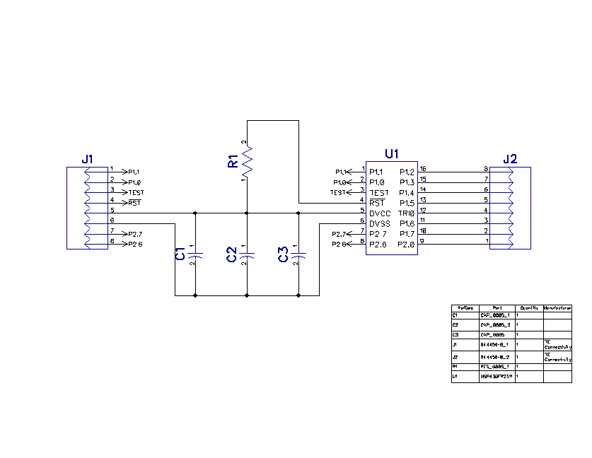
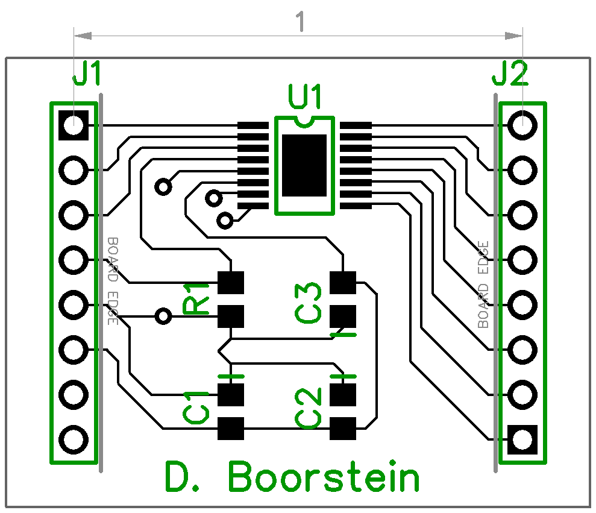

# PCB Design

This sub-folder contains the Gerber files for the MSP430FR2311 Breakout Board. This includes a .zip of all the files required for PCB printing according to the Rowan University ECE Department guidelines (see [Rowan ECE Department Printed Circuit Board...](Rowan ECE Department Printed Circuit Board Design and Ordering Process with stencil.pdf)).

## Schematic

## Board

